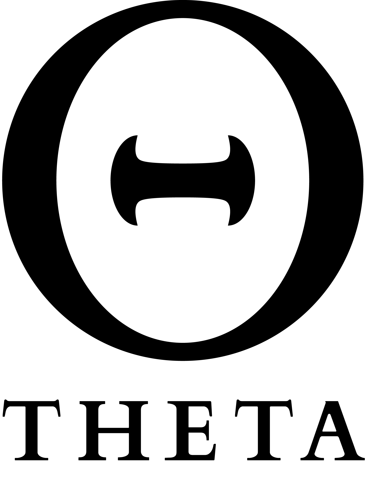

# ThetaStation

| Key  | Value |
| ------------- | ------------- |
| Host(s) | `GH@Dushess0/DSC@dushess`, `GH@LudwigVonChesterfield/DSC@lud.uk`, `GH@KIBORG04/DSC@kib.org`|
| Repository  | https://github.com/ThetaStation/ThetaStation |
| Discord  |  https://discord.gg/mmEprDu7RW  |
| Website | https://www.thetastation.org/ |
| Language | EN, RU |
| Info | Theta Station is currently a PvP, ship-to-ship, action oriented LRP server. |
| Date of Creation | 2022-06-06 |
| Date of End |  N/A |
| Sources | `DSC@bartnixon` |

## Miscellaneous Information

Theta Station has come a long way and wanted to be an MRP build about the catastrophe.
Half a year later, the path has changed to PvP build. Largely thanks to `GH@IlinMihail/DSC@ilinm`. Official release with [trailer](https://youtu.be/wMnPygVKjAs) occurred on 2023-07-20.
