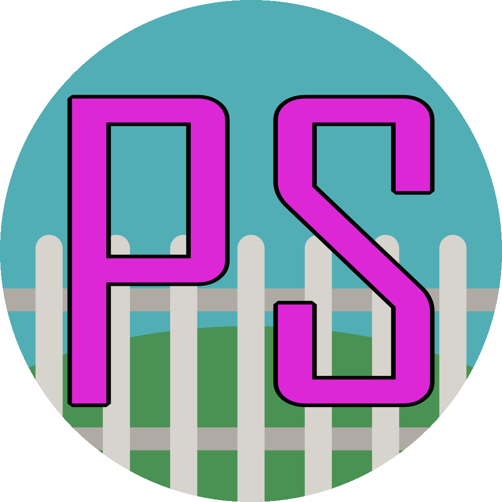

# ParkStation

| Key  | Value |
| ------------- | ------------- |
| Hosts | `GH@DEATHB4DEFEAT/DSC@DEATHB4DEFEAT#4404(801294818839756811)`, `GH@Pspritechologist/DSC@🦆 Pspritechologist 🦆#9442(189494600342175745)` |
| Repository  | https://github.com/Park-Station/Parkstation/ |
| Discord  |  https://discord.gg/49KeKwXc8g |
| Language | English |
| Info | A more roleplay focused fork with longer rounds and a generally chiller experience  |
| Date of Creation | 2022-12-07 |
| Date of End | N/A |
| Sources | `GH@DEATHB4DEFEAT/DSC@DEATHB4DEFEAT#4404(801294818839756811)`, `GH@Pspritechologist/DSC@🦆 Pspritechologist 🦆#9442(189494600342175745)` |

## Features

A loadout system, allowing you to select some items/clothing to spawn with when you join the shift using a point system.

Underwear.

Trait point system, selecting negative traits gives you points to use on positive traits.
Several new traits.

Tons of new markings for most species.

No Captain job, instead the station is managed by the heads as a board.

A basic implementation of the Station AI.
