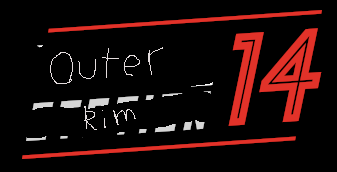

# Outer Rim 14

| Key  | Value |
| ------------- | ------------- |
| Host(s) | `GH@moonheart08/DSC@/tmp/moony#0029` |
| Repository  | https://github.com/moonheart08/outer-rim-14 |
| Discord  | https://discord.gg/G89SKfzMGq |
| Website | N/A |
| Info | Features unique mechanics related to ship gameplay, and a procedurally generated overworld. Inspired by Shiptest SS13. |
| Date of Creation | December 2021 |
| Date of End |  N/A |
| Sources | Outer Rim Discord, SS14 Discord, `DSC@/tmp/moony#0029` |